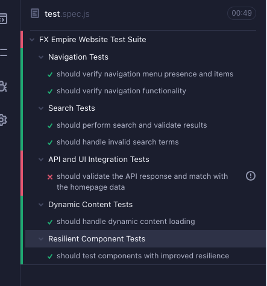

# FXEmpire Automation Test Suite

This test suite contains comprehensive Cypress automation tests for the FXEmpire website, focusing on functional testing, API integration, and improved test coverage.

## Test Structure

The test suite is organized into four main sections:

1. **Navigation Tests**
   - Verification of menu structure and presence
   - Testing navigation functionality between pages

2. **Search Tests**
   - Testing search functionality with valid search terms
   - Handling of invalid search terms

3. **API Integration Tests**
   - Validation of top articles API response
   - Cross-verification between API data and UI content

4. **Dynamic Content & Component Tests**
   - Handling of lazy-loaded content
   - Resilient testing of dynamic elements

## Issues Found and Improvements

### 1. API Response Discrepancies

**Issue:** The API response structure does not match the requirements specified in the assignment:
- The API returns only 4 articles, but the assignment requires validating at least 5 articles
- Field names in the API response don't match those specified in the assignment:
  - Uses `articleLink` instead of the expected `url`
  - Uses `publishedDate` instead of the expected `publishedAt`

**Improvement:**
- Added comprehensive logging of API response to highlight discrepancies
- Implemented flexible property checking that can handle field name differences
- Added clear validation message when article count doesn't meet requirements

**Before:**
```javascript
expect(article).to.have.property('url');
expect(article).to.have.property('publishedAt');
expect(response.body).to.have.length.of.at.least(5);
```

**After:**
```javascript
// Validate required properties with field name mapping
expect(article).to.have.property('id');
expect(article).to.have.property('title');
expect(article).to.have.property('articleLink'); // Instead of 'url' mentioned in assignment
expect(article).to.have.property('publishedDate'); // Instead of 'publishedAt' mentioned in assignment

// Log discrepancy when article count requirement isn't met
const articleCount = response.body.length;
if (articleCount < 5) {
  cy.log(`WARNING: API returned ${articleCount} articles, but requirement is for at least 5 articles`);
}
expect(response.body).to.have.length.of.at.least(5);
```

### 2. Brittle Selectors

**Issue:** Many websites use dynamic class names that change between builds, causing tests to fail unnecessarily.

**Improvement:**
- Used data attribute selectors (`[data-name="hamburger menu"]`) instead of class selectors
- Implemented multiple selector options for greater resilience
- Added proper timeouts for all element selections

**Before:**
```javascript
cy.get('.menu-button').click();
cy.get('.search-input').type('Bitcoin');
```

**After:**
```javascript
cy.get('[data-name="hamburger menu"]', { timeout: 10000 })
  .should('be.visible')
  .click();
cy.get('[data-name="main search"]', { timeout: 10000 })
  .should('be.enabled')
  .type('Bitcoin{enter}');
```

### 2. Error Handling and Logging

**Issue:** Tests failed without providing clear reasons or context, making debugging difficult.

**Improvement:**
- Implemented comprehensive try-catch blocks
- Added detailed logging for each test step
- Included contextual information in error messages

**Before:**
```javascript
openHamburgerMenu();
navigateToMarkets();
```

**After:**
```javascript
try {
  cy.log('Opening hamburger menu');
  openHamburgerMenu();
  cy.log('Navigating to Markets');
  navigateTo(selectors.marketLink, '/markets');
} catch (error) {
  cy.log(`Error in navigation test: ${error.message}`);
  throw error;
}
```

### 3. Inconsistent API-UI Validation

**Issue:** Original tests used strict equality checks for article titles, which fail due to formatting differences.

**Improvement:**
- Implemented flexible comparison between API and UI content
- Added detailed logging of comparison results
- Used soft assertions where appropriate

**Before:**
```javascript
expect(homepageTitle).to.equal(apiTitle);
```

**After:**
```javascript
// Log both titles for comparison
cy.log('Comparing titles:');
cy.log(`API title: ${apiTitle}`);
cy.log(`UI title: ${homepageTitle}`);

// Check if titles match or if UI title contains API title
if (apiTitle !== homepageTitle) {
  // Log detailed mismatch information
  cy.log('Title Mismatch Details:');
  cy.log(`Index: ${index}`);
  cy.log(`API Title: ${apiTitle}`);
  cy.log(`Homepage Title: ${homepageTitle}`);
  cy.log(`API Article Link: ${apiArticles[index].articleLink}`);

  // Use a softer assertion
  expect(homepageTitle).to.include(apiTitle);
}
```

### 4. Handling Dynamic Content

**Issue:** Tests failed when dealing with lazy-loaded or asynchronously loaded content.

**Improvement:**
- Added a retry mechanism for unstable elements
- Implemented interceptors for network requests
- Added proper handling of loading indicators

**Example of Retry Mechanism:**
```javascript
const retryGetElement = (selector, options = {}) => {
  const { timeout = 15000, retries = 3, delay = 1000 } = options;
  
  return cy.wrap(null).then(() => {
    let attempts = 0;
    
    const attempt = () => {
      attempts++;
      cy.log(`Attempt ${attempts} to get element: ${selector}`);
      
      return cy.get('body').then($body => {
        if ($body.find(selector).length > 0) {
          return cy.get(selector, { timeout });
        } else if (attempts < retries) {
          cy.wait(delay);
          return attempt();
        } else {
          throw new Error(`Element ${selector} not found after ${retries} attempts`);
        }
      });
    };
    
    return attempt();
  });
};
```

### 5. Network Conditions Handling

**Issue:** Tests were flaky under different network conditions.

**Improvement:**
- Added network throttling to test under slow connections
- Implemented proper waiting strategies for API requests
- Added flexible timeouts for dynamic content

```javascript
// Throttle network to test behavior under slow connections
if (Cypress.env('throttleNetwork')) {
  cy.log('Throttling network to slow 3G');
  cy.throttleNetwork('slow3g');
}

// Later reset network throttling
if (Cypress.env('throttleNetwork')) {
  cy.log('Resetting network to online');
  cy.throttleNetwork('online');
}
```

## Running the Tests

1. Install dependencies:
```
npm install cypress --save-dev
```

2. Add the following to cypress.config.js:
```javascript
module.exports = {
  e2e: {
    baseUrl: 'https://fxempire.com',
    experimentalNetworkStubbing: true,
    env: {
      throttleNetwork: false // Set to true to enable network throttling tests
    }
  }
};
```

3. Run the tests:
```
npx cypress open
and e2e tests and select test.spec.js
```
or 
```
npx cypress run --spec "cypress/e2e/test.spec.js"

or 
npm run test
```

## Future Improvements

1. **Page Object Model Implementation**
   - Further refactor tests into a complete Page Object Model
   - Move selectors and functions to dedicated files

2. **Additional Test Coverage**
   - Add tests for more components like charts and calculators
   - Implement responsive design testing

3. **Visual Regression Testing**
   - Add visual comparison tests for critical components
   - Implement baseline screenshots for UI elements

4. **CI/CD Integration**
   - Set up tests to run in CI/CD pipeline
   - Add reporting and notifications

   test run results:
   
